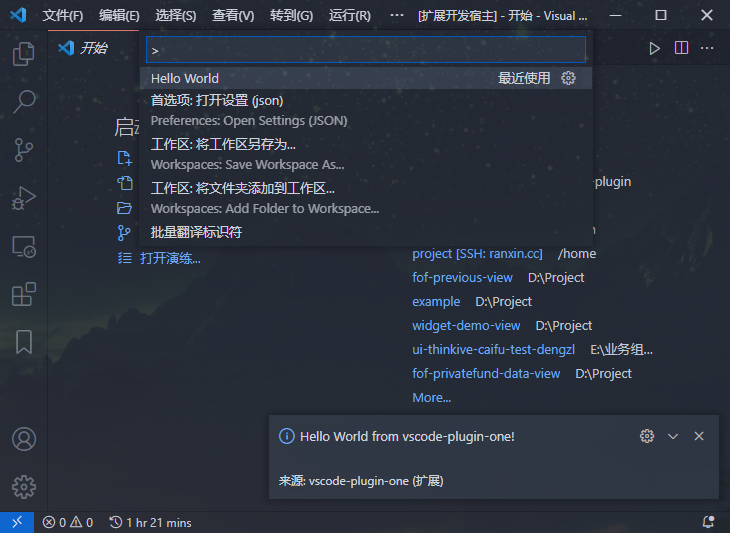

# 前言

介绍并记录一下`vscode`插件如何开发,从**创建**到**调试**再到**打包发布**的一个流程。

# 初次开发调试

## 1.创建你的第一个插件

使用`yo`创建你的第一个`vscode`创建进行调试开发!

### 安装环境

需要`yo`创建插件项目,`generator-code`进行开发调试

```bash
$ npm install -g yo generator-code
```

### 创建插件项目

输入后进行选项选择自动创建示例项目

```bash
$ yo code
```

### 调试

在`vscode`打开此项目后，按`F5`进行开发调试



### 示例介绍

