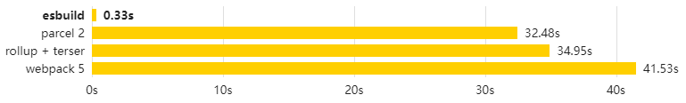

# ESBuild-介绍

## ESBuild是什么

一个非常快速的 JavaScript 打包器。esbuild速度对比目前使用的构建工具可能快10~100倍。但esbuild仅可作为基础构建使用，一种偏底层的模块打包工具，需要在它的基础上二次封装。

主要特点：

- 极速，无需缓存
- 支持ES6 和 CommonJS 模块
- 支持按需引入 [Tree Shaking](https://zhuanlan.zhihu.com/p/127804516)
- 拥有JavaScript 和 Go的[API](https://esbuild.github.io/api/)
- 支持[TypeScript](https://esbuild.github.io/content-types/#typescript)和[JSX](https://esbuild.github.io/content-types/#jsx)语法
- 支持[Source Map](https://esbuild.github.io/api/#sourcemap)
- 支持压缩代码[minify](https://esbuild.github.io/api/#minify)
- \[实验性\][plugins插件化](https://esbuild.github.io/plugins)

## ESBuild为什么快

### 1.使用GoLang实现

#### GoLang是编译型语言

GoLang在运行前已经转义好了整个程序,程序在执行之前需要一个专门的编译过程，把程序编译成 为机器语言的文件，运行时不需要重新翻译，直接使用[编译](https://baike.baidu.com/item/编译)的结果就行了。程序执行效率高，依赖编译器，跨平台性差些。

JavaScript在运行时,边转义边运行,程序在运行时才翻译成[机器语言](https://baike.baidu.com/item/机器语言)，每执 行一次都要翻译一次。因此效率比较低。在运行程序的时候才翻译，专门有一个解释器去进行翻译，每个语句都是执行的时候才翻译。效率比较低，依赖解释器，跨平台性好。

#### GoLange使用多线程运行

Go 并发模型比传统的多线程模型更快。而JavaScript是单线程，同一个时间只能做一件事。

### 2.ESBuild仅做基础编译

ESBuild仅提供了构建一个**现代** Web 应用所需的最小功能集合。

ESBuild也明确声明未来不会内置Vue、Angular等其他框架SFC**模板解析**支持。

ESBuild重写整套编译流程、**js、ts、jsx、json 等资源文件的加载、解析、链接、代码**生成逻辑。

ESBuild去除Babel，PostCss支持，**仅作为基础构建使用**。效率更高但需要使用Babel、PostCss需要二次封装开发后才能使用。(例如其他模板SFC的支持、Babel、PostCss。当然这些转义需要额外的时间..)

