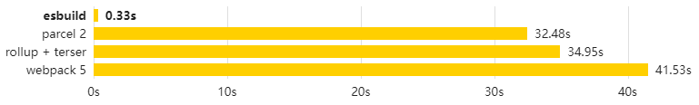
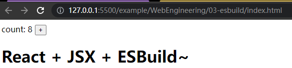
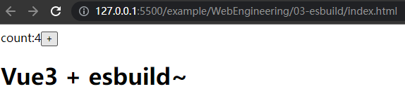

# ESBuild-介绍

## ESBuild是什么

一个非常快速的 JavaScript 打包器。esbuild速度对比目前使用的构建工具可能快10~100倍。但esbuild仅可作为基础构建使用，一种偏底层的模块打包工具，需要在它的基础上二次封装。



主要特点：

- 极速，无需缓存
- 支持ES6 和 CommonJS 模块
- 支持按需引入 [Tree Shaking](https://zhuanlan.zhihu.com/p/127804516)
- 拥有JavaScript 和 Go的[API](https://esbuild.github.io/api/)
- 支持[TypeScript](https://esbuild.github.io/content-types/#typescript)和[JSX](https://esbuild.github.io/content-types/#jsx)语法
- 支持[Source Map](https://esbuild.github.io/api/#sourcemap)
- 支持压缩代码[minify](https://esbuild.github.io/api/#minify)
- \[实验性\][plugins插件化](https://esbuild.github.io/plugins)

## ESBuild为什么快

### 1.使用GoLang实现

#### GoLang是编译型语言

GoLang在运行前已经转义好了整个程序,程序在执行之前需要一个专门的编译过程，把程序编译成 为机器语言的文件，运行时不需要重新翻译，直接使用[编译](https://baike.baidu.com/item/编译)的结果就行了。程序执行效率高，依赖编译器，跨平台性差些。

JavaScript在运行时,边转义边运行,程序在运行时才翻译成[机器语言](https://baike.baidu.com/item/机器语言)，每执 行一次都要翻译一次。因此效率比较低。在运行程序的时候才翻译，专门有一个解释器去进行翻译，每个语句都是执行的时候才翻译。效率比较低，依赖解释器，跨平台性好。

#### GoLange使用多线程运行

Go 并发模型比传统的多线程模型更快。而JavaScript是单线程，同一个时间只能做一件事。

### 2.ESBuild仅做基础编译

ESBuild仅提供了构建一个**现代** Web 应用所需的最小功能集合。

ESBuild也明确声明未来不会内置Vue、Angular等其他框架SFC**模板解析**支持。

ESBuild重写整套编译流程、**js、ts、jsx、json 等资源文件的加载、解析、链接、代码**生成逻辑。

ESBuild去除Babel，PostCss支持，**仅作为基础构建使用**。效率更高但需要使用Babel、PostCss需要二次封装开发后才能使用。(例如其他模板SFC的支持、Babel、PostCss。当然这些转义需要额外的时间..) 

# ESBuild-基础使用

## React+ESBuild

> ESBuild对React有内置的支持,可支持JSX的自动转换.

### 1.初始化一个npm项目,安装React和ESBuild

```bash
# 初始化一个npm
$ npm init -y
# 安装React和ESBuild
$ npm i esbuild react react-dom  #npm
$ pnpm i esbuild react react-dom  #pnpm
$ yarn add esbuild react react-dom  #yarn
```

### 2.创建入口文件

> 在src下创建app.jsx

```bash
# 目录结构
root
├── package.json
└── src
   └── app.jsx
```

### 3.编写一些React内容

```jsx
/* app.jsx */
import React, { useState } from 'react'
import { render } from 'react-dom'

const App = () => {
    const [count, setCount] = useState(0)
    return <div>
        <div>
            <span>count: {count} </span>
            <button onClick={() => setCount(count + 1)}>+</button>
        </div>
        <h1>React + JSX + ESBuild~</h1>
    </div>
}

render(<App />, document.getElementById('app'))
```

### 4.添加ESBuild打包命令并打包

```bash
# 添加打包命令 
$ npm set-script build:react  "esbuild ./src/app.jsx --bundle --outfile=./dist/build.js"  
# 执行打包命令
$ npm run build:react
# 执行结果
# dist\build.js  893.1kb
```

### 5.将打包完成的build.js应用在HTML上

> 主目录添加一个index.html文件

```bash
# 目录结构
root
├── package.json
├── index.html
└── src
   └── app.jsx
```

> html使用build.js

```html
<!-- index.html -->
<!DOCTYPE html>
<html lang="en">
<head>
    <meta charset="UTF-8">
    <meta http-equiv="X-UA-Compatible" content="IE=edge">
    <meta name="viewport" content="width=device-width, initial-scale=1.0">
    <title>esbuild-test</title>
</head>
<body>
    <div id="app"></div>
</body>
<script type="module" src="./dist/build.js"></script>
</html>
```

> 为了**防止跨域问题**，启动一个服务将网页打开




## Vue3+ESBuild

> ESBuild**不支持.Vue文件**的解析，需要手动编写渲染函数，**仅可使用.js和h标签渲染**

### 1.初始化一个npm项目,安装Vue3和ESBuild

```bash
# 初始化一个npm
$ npm init -y
# 安装React和ESBuild
$ npm i esbuild vue  #npm
$ pnpm i esbuild vue  #pnpm
$ yarn add esbuild vue  #yarn
```

### 2.创建入口文件

> 在src下创建app.js

```bash
# 目录结构
root
├── package.json
└── src
   └── app.js
```

### 3.编写一些Vue3内容

```js
import { createApp, defineComponent, h, ref } from 'vue'

const App = defineComponent({
    setup() {
        const count = ref(0)
        return {
            count
        }
    },
    render() {
        return h('div',
            [
                h('div',
                    [
                        h('span', "count:" + this.count),
                        h('button', { onClick: () => this.count++ }, "+"),
                    ]),
                h('h1', 'Vue3 + esbuild~')
            ])
    }
})

const app = createApp(App)
app.mount('#app')
```

### 4.添加ESBuild打包命令并打包

```bash
# 添加打包命令 
$ npm set-script build:vue "esbuild ./src/app.js --bundle --outfile=./dist/build.js"  
# 执行打包命令
$ npm run build:vue
# 执行结果
# dist\build.js  208.1kb
```

### 5.将打包完成的build.js应用在HTML上

> 主目录添加一个index.html文件

```bash
# 目录结构
root
├── package.json
├── index.html
└── src
   └── app.js
```

> html使用build.js

```html
<!-- index.html -->
<!DOCTYPE html>
<html lang="en">
<head>
    <meta charset="UTF-8">
    <meta http-equiv="X-UA-Compatible" content="IE=edge">
    <meta name="viewport" content="width=device-width, initial-scale=1.0">
    <title>esbuild-test</title>
</head>
<body>
    <div id="app"></div>
</body>
<script type="module" src="./dist/build.js"></script>
</html>
```

> 为了**防止跨域问题**，启动一个服务将网页打开




# 参考资料

- [esbuild](https://esbuild.github.io/)
- [Esbuild 为什么那么快](https://zhuanlan.zhihu.com/p/379164359)	author:[@XXX](http://ranxin.cc)
- [Esbuild 为什么那么快](https://zhuanlan.zhihu.com/p/379164359)	author:[@XXX](http://ranxin.cc)


# 扩展阅读

- [JavaScript Source Map 详解](http://www.ruanyifeng.com/blog/2013/01/javascript_source_map.html)
- [浅析 Tree Shaking](https://zhuanlan.zhihu.com/p/127804516)


