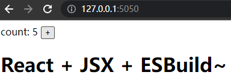

# ESBuild-介绍

## ESBuild是什么

一个非常快速的 JavaScript 打包器。esbuild速度对比目前使用的构建工具可能快10~100倍。但esbuild仅可作为基础构建使用，一种偏底层的模块打包工具，需要在它的基础上二次封装。


主要特点：

- 极速，无需缓存
- 支持ES6 和 CommonJS 模块
- 支持按需引入 [Tree Shaking](https://zhuanlan.zhihu.com/p/127804516)
- 拥有JavaScript 和 Go的[API](https://esbuild.github.io/api/)
- 支持[TypeScript](https://esbuild.github.io/content-types/#typescript)和[JSX](https://esbuild.github.io/content-types/#jsx)语法
- 支持[Source Map](https://esbuild.github.io/api/#sourcemap)
- 支持压缩代码[minify](https://esbuild.github.io/api/#minify)
- \[实验性\][plugins插件化](https://esbuild.github.io/plugins)

## ESBuild为什么快

### 1.使用GoLang实现

#### GoLang是编译型语言

GoLang在运行前已经转义好了整个程序,程序在执行之前需要一个专门的编译过程，把程序编译成 为机器语言的文件，运行时不需要重新翻译，直接使用[编译](https://baike.baidu.com/item/编译)的结果就行了。程序执行效率高，依赖编译器，跨平台性差些。

JavaScript在运行时,边转义边运行,程序在运行时才翻译成[机器语言](https://baike.baidu.com/item/机器语言)，每执 行一次都要翻译一次。因此效率比较低。在运行程序的时候才翻译，专门有一个解释器去进行翻译，每个语句都是执行的时候才翻译。效率比较低，依赖解释器，跨平台性好。

#### GoLange使用多线程运行

Go 并发模型比传统的多线程模型更快。而JavaScript是单线程，同一个时间只能做一件事。

### 2.ESBuild仅做基础编译

ESBuild仅提供了构建一个**现代** Web 应用所需的最小功能集合。

ESBuild也明确声明未来不会内置Vue、Angular等其他框架**模板解析**支持。

ESBuild重写整套编译流程、**js、ts、jsx、json 等资源文件的加载、解析、链接、代码**生成逻辑。

ESBuild去除Babel，PostCss支持，**仅作为基础构建使用**。效率更高但需要使用Babel、PostCss需要二次封装开发后才能使用。(例如其他模板的支持、Babel、PostCss。当然这些转义需要额外的时间..) 

# ESBuild-基础使用

首先需要初始化一个esbuild **或者** 全局安装一个esbuild

```bash
# 初始化一个npm
$ npm init -y
# 安装React和ESBuild
$ npm i esbuild  #npm
$ pnpm i esbuild  #pnpm
$ yarn add esbuild  #yarn

# or  也可以全局安装
$ npm i esbuild -g
```

## 命令式选项

### 0.无功能运行

#### 示例文件

```jsx
/* test.jsx */
const a = () => {
    return <a>这是一个A标签</a>
}
```

#### 运行esbuild打包

```bash
$ npx esbuild ./test.jsx
```

> 未输出,但返回了

#### 手动导出到文件

```bash
$ npx esbuild ./test.jsx >> buildTest.js
```

导出结果

```js
/* buildTest.js */
const a = () => {
  return /* @__PURE__ */ React.createElement("a", null, "\u8FD9\u662FA\u6807\u7B7E");
};
```

### 1.指定输出位置

#### 示例文件

```jsx
/* test.jsx */
const a = () => {
    return <a>这是一个A标签</a>
}
```

#### 运行esbuild打包

```bash
# 输出到文件
$ npx esbuild ./test.jsx --outfile=./buildTest.js
# 输出到文件夹 会在dist文件夹生成一个test.js
$ npx esbuild ./test.jsx --outdir=./dist
```

#### 构建效果

> 生成了一个buildTest.js文件,重复执行会覆盖之前的文件

```js
/* buildTest.js */
const a = () => {
  return /* @__PURE__ */ React.createElement("a", null, "\u8FD9\u662FA\u6807\u7B7E");
};
```

### 2.捆绑包

#### 示例文件

```jsx
/* test2.jsx */
export const add = (a, b) => {
    return a + b
}
```

```jsx
/* test.jsx */
import { add } from './test2.jsx'
export const b = () => {
    return <div>
        { add(1, 2) }
    </div>
}
```

运行esbuild打包，将入口中import的内容以及递归的import打包成一个文件

> 与test.jsx有联系的包都会捆绑为一个js文件

```bash
$ npx esbuild ./test.jsx --bundle --outfile=./buildTest.js
```

#### 使用--bundle构建

```js
(() => {
  // test2.jsx
  var add = (a, b2) => {
    return a + b2;
  };

  // test.jsx
  var b = () => {
    return /* @__PURE__ */ React.createElement("div", null, add(1, 2));
  };
})();
```

#### 不使用--bundel构建

```jsx
import { add } from "./test2.jsx";
export const b = () => {
  return /* @__PURE__ */ React.createElement("div", null, add(1, 2));
};
```

### 3.外部包

使用捆绑包时,有需要外部引入的包可以添加此参数。标记为外部包的导入将被保留，而不是被捆绑。

#### 示例项目

```bash
# 安装一个包
$ npm i react
```

#### 示例文件

```jsx
import React from 'react'
export const a = () => {
    return <a>这是一个A标签</a>
}
```

#### 添加捆绑包和外部包运行

```bash
$ npx esbuild ./test.jsx --outfile=./buildTest.js --bundle --external:react
# 如果是多个  --external:react --external:vue --external:lodash
```

#### 构建效果

```js
(() => {
  var __create = Object.create;
  var __defProp = Object.defineProperty;
  var __markAsModule = (target) => __defProp(target, "__esModule", { value: true });
  var __require = /* @__PURE__ */ ((x) => typeof require !== "undefined" ? require : typeof
  ......
  // 此处省略约20行
                                   
  // test.jsx
  var import_react = __toESM(__require("react"));
  var a = () => {
    return /* @__PURE__ */ import_react.default.createElement("a", null, "\u8FD9\u662F\u4E00\u4E2AA\u6807\u7B7E");
  };
})();
```

#### 不指定外部构建效果

```js
(() => { 
  var __create = Object.create;
  var __defProp = Object.defineProperty;
  var __getOwnPropDesc = Object.getOwnPropertyDescriptor;
  var __getOwnPropNames = Object.getOwnPropertyNames;
  var __getProtoOf = Object.getPrototypeOf;
  var __hasOwnProp = Object.prototype.hasOwnProperty;
  var __markAsModule = (target) => __defProp(target, "__esModule", { value: true });
  var __commonJS = (cb, mod) => function __require() {
    return mod || (0, cb[__getOwnPropNames(cb)[0]])((mod = { exports: {} }).exports, mod), mod.exports;
  };
  ......
  // 此处省略约1600行
  
  // node_modules/.pnpm/registry.npmjs.org+react@17.0.2/node_modules/react/index.js
  var require_react = __commonJS({
    "node_modules/.pnpm/registry.npmjs.org+react@17.0.2/node_modules/react/index.js"(exports, module) {
      "use strict";
      if (false) {
        module.exports = null;
      } else {
        module.exports = require_react_development();
      }
    }
  });

  // test.jsx
  var import_react = __toESM(require_react());
  var a = () => {
    return /* @__PURE__ */ import_react.default.createElement("a", null, "\u8FD9\u662F\u4E00\u4E2AA\u6807\u7B7E");
  };
})();
```


### 4.定义全局/环境变量

#### 示例文件

```jsx
export const b = () => {
    return <div>
        { NODE_ENV }
    </div>
}
```

#### 运行esbuild打包

```bash
$ npx esbuild ./test.jsx --outfile=./buildTest.js --define:NODE_ENV="'测试define选项！！'" 
```

#### 构建效果

```js
export const b = () => {
  /* 此处将NODE_ENV给自动替换了 */
  return /* @__PURE__ */ React.createElement("div", null, "test-define");
};
```

### 5.压缩代码(minify)

#### 示例文件

```jsx
/* test.jsx */
const a = () => {
    return <a>这是一个A标签</a>
}
```

#### 运行esbuild打包

```bash
$ npx esbuild ./test.jsx --outfile=./buildTest.js --minify
```

#### 构建效果

```jsx
const a=()=>React.createElement("a",null,"\u8FD9\u662F\u4E00\u4E2AA\u6807\u7B7E");
```

### 6.输出格式

#### 示例文件

```jsx
/* test.jsx */
export const a = () => {
    return <a>这是一个A标签</a>
}
```

#### 运行esbuild打包

```bash
$ npx esbuild ./test.jsx --outfile=./buildTest.js --formart="cjs" # CommonJS
$ npx esbuild ./test.jsx --outfile=./buildTest.js --formart="esm" # ESModule
$ npx esbuild ./test.jsx --outfile=./buildTest.js --formart="iife" # 立即执行函数
```

#### cjs构建效果

> node.js 运行模块

```js
var __defProp = Object.defineProperty;
var __getOwnPropDesc = Object.getOwnPropertyDescriptor;
var __getOwnPropNames = Object.getOwnPropertyNames;
var __hasOwnProp = Object.prototype.hasOwnProperty;
var __markAsModule = (target) => __defProp(target, "__esModule", { value: true });
var __export = (target, all) => {
  for (var name in all)
    __defProp(target, name, { get: all[name], enumerable: true });
};
var __reExport = (target, module2, copyDefault, desc) => {
  if (module2 && typeof module2 === "object" || typeof module2 === "function") {
    for (let key of __getOwnPropNames(module2))
      if (!__hasOwnProp.call(target, key) && (copyDefault || key !== "default"))
        __defProp(target, key, { get: () => module2[key], enumerable: !(desc = __getOwnPropDesc(module2, key)) || desc.enumerable });
  }
  return target;
};
var __toCommonJS = /* @__PURE__ */ ((cache) => {
  return (module2, temp) => {
    return cache && cache.get(module2) || (temp = __reExport(__markAsModule({}), module2, 1), cache && cache.set(module2, temp), temp);
  };
})(typeof WeakMap !== "undefined" ? /* @__PURE__ */ new WeakMap() : 0);
var test_exports = {};
__export(test_exports, {
  a: () => a
});
const a = () => {
  return /* @__PURE__ */ React.createElement("a", null, "\u8FD9\u662F\u4E00\u4E2AA\u6807\u7B7E");
};
module.exports = __toCommonJS(test_exports);
```

#### esm构建效果

> es模块化
>
> 如果在html的script标签中使用需要添加 type="module"
>
> 如果在node环境使用需要.mjs后缀或是在package.json中配置"type": "module"

```js
const a = () => {
  return /* @__PURE__ */ React.createElement("a", null, "\u8FD9\u662F\u4E00\u4E2AA\u6807\u7B7E");
};
export {
  a
};
```

#### iife构建效果

```js
(() => {
  const a = () => {
    return /* @__PURE__ */ React.createElement("a", null, "\u8FD9\u662F\u4E00\u4E2AA\u6807\u7B7E");
  };
})();
```

### 7.平台

#### 运行esbuild打包

```bash
$ npx esbuild --platform=node
```

可选值: node | browser | neutral

### 8.服务

esbuild服务可以在指定文件夹构建服务，并在每次浏览器访问时重新构建新的文件

#### 启动服务

> 指定的文件夹必须有index.html才可以启动，否则会报错

```bash
# 在当前文件夹启动服务
$ npx esbuild --servedir=./
```

#### 指定端口号

```bash
$ npx esbuild --servedir=./ --serve=3000
```

#### 构建的文件输出到服务器

```bash
$ npx esbuild --servedir=./ --outfile=./build.js
```

这个时候 localhost:8000/build.js 将会在启动和每次访问时构建

> 在index.html使用构建好的 localhost:8000/build.js 

```html
<!-- index.html -->
<!DOCTYPE html>
<html lang="en">
<head>
    <meta charset="UTF-8">
    <meta http-equiv="X-UA-Compatible" content="IE=edge">
    <meta name="viewport" content="width=device-width, initial-scale=1.0">
    <title>esbuild</title>
</head>
<body>
    <div id="app"></div>
</body>
<script type="module" src="./build.js"></script>
</html>
```

#### 也可以捆绑包等..

```bash
$ npx esbuild --servedir=./ --outfile=./build.js --bundle
```

### 9.监听修改

#### 运行esbuild监听打包

```bash
$ npx esbuild ./test.jsx --bundle --outfile=./buildTest.js --minify --watch
```

#### 当检测到修改

> test.jsx修改时,将会自动重新构建

```bash
# [watch] build finished, watching for changes...
# [watch] build started (change: "test.jsx")
# [watch] build finished
```

> 关联文件修改也会自动重新构建

```jsx
/* test.jsx */
import test2 from './test2.jsx'
```

这时，修改test2文件也会自动重新构建。

### 10.源代码

开发环境的很多代码是在浏览器是无法运行的，例如less、sass、jsx。这些代码需要经过构建之后才可以在浏览器中运行。但构建后的代码的可读性会大幅度降低，在开发调试期间定位代码和问题就变得相当麻烦。

> 一般来说仅在开发环境中使用，方便调试的时候看真实代码。如果在生产使用将会暴露源代码。

#### 示例文件

```jsx
/* test.jsx */
const consoleChinese = () => {
    console.log('中文会被转换')
}
consoleChinese()
```

#### 运行esbuild打包

```bash
$ npx esbuild ./test.jsx --bundle --outfile=./buildTest.js --minify --sourcemap
```

#### 构建效果

> 会生成两个文件,一个正常build构建的文件和一个.map原代码文件。

```js
/* buildTest.js */
(()=>{var o=()=>{console.log("\u4E2D\u6587\u4F1A\u88AB\u8F6C\u6362")};o();})();

// 使用shurcemap后会自动为build文件添加下面这条注释，让浏览器识别
//# sourceMappingURL=buildTest.js.map
```

```json
/* buildTest.js.map */
{
  "version": 3,
  "sources": ["test.jsx"],
  "sourcesContent": ["/* test.jsx */\r\nconst consoleChinese = () => {\r\n    console.log('\u4E2D\u6587\u4F1A\u88AB\u8F6C\u6362')\r\n}\r\nconsoleChinese()\r\n"],
  "mappings": "MACA,GAAM,GAAiB,IAAM,CACzB,QAAQ,IAAI,yCAEhB",
  "names": []
}
```

这时在浏览器中，查看代码报错或是断点,可以看到我们的示例

console输出

跳转查看代码

#### 不使用源代码构建

console输出


跳转查看代码

#### 4种模式

##### 1.linked(默认)

源映射与输出文件一起生成到单独的`buildTest.js`输出文件中，并且`buildTest.js`输出文件包含`//# sourceMappingURL=`指向输出文件的特殊注释`buildTest.js.map`。当您打开调试器时，浏览器就知道在哪里可以找到给定文件的源映射。

```bash
$ npx esbuild ./test.ts --sourcemap --outfile=./buildTest.js
```

##### 2.external

与linked模式几乎相同，不同的点在于输出的`buildTest.js`文件不会包含`//# sourceMappingURL=`特殊注释，浏览器也无法找到原映射

```bash
$ npx esbuild ./test.ts --sourcemap=external --outfile=./buildTest.js
```

##### 3.inline

不输出`buildTest.js.map`文件，直接将`buildTest.js.map`通过base64输出到`buildTest.js`文件中。`buildTest.js`文件包含`//# sourceMappingURL=`base64代码

```bash
$ npx esbuild ./test.ts --sourcemap=inline --outfile=./buildTest.js
```


##### 4.both

external和inline的结合,会生成`.js.map`文件，也会直接将`.js.map`通过base64输出到`.js`文件中。`buildTest.js`文件包含`//# sourceMappingURL=`base64代码

```bash
$ npx esbuild ./test.ts --sourcemap=both --outfile=./buildTest.js
```


### 11.转换兼容

#### 示例文件

```jsx
/* test.jsx */
const consoleChinese = async () => {
    console?.log?.('中文会被转换')
    await new Promise()
}
consoleChinese()
```

#### 运行esbuild打包

> 默认为 esnext，最新的规则 不做转换。

```bash
$ npx esbuild ./test.ts --target=es2020,chrome58,firefox57,safari11,edge16,node12
```

设定指定兼容的es版本或浏览器版本，目前不支持es6=>es5的转换。如果设置为es5那么文件中使用了es6的代码将会无法构建打包

#### 构建效果

```js
/* es6 */
var __async = (__this, __arguments, generator) => {
  return new Promise((resolve, reject) => {
    var fulfilled = (value) => {
      try {
        step(generator.next(value));
      } catch (e) {
        reject(e);
      }
    };
    var rejected = (value) => {
      try {
        step(generator.throw(value));
      } catch (e) {
        reject(e);
      }
    };
    var step = (x) => x.done ? resolve(x.value) : Promise.resolve(x.value).then(fulfilled, rejected);
    step((generator = generator.apply(__this, __arguments)).next());
  });
};
const consoleChinese = () => __async(this, null, function* () {
  var _a;
  (_a = console == null ? void 0 : console.log) == null ? void 0 : _a.call(console, "\u4E2D\u6587\u4F1A\u88AB\u8F6C\u6362");
  yield new Promise();
});
consoleChinese();
```

```js
/* es2019 */
/* es10 */
/* 因为es10支持async/await 但不支持 ?. 链式访问 */
const consoleChinese = async () => {
  var _a;
  (_a = console == null ? void 0 : console.log) == null ? void 0 : _a.call(console, "\u4E2D\u6587\u4F1A\u88AB\u8F6C\u6362");
  await new Promise();
};
consoleChinese();
```


## 代码式使用

esbuild除了在控制台直接使用,也可以在js代码或是go代码中使用。这里仅说明在js中如何使用

### 1.build

传入一个选项,使用起来其实和命令式没有太大的区别

> 随便一段例子即可理解，第一个options就是原来命令式的参数

```js
import { build } from 'esbuild'
build({
    entryPoints: [resolve(__dirname, '../app.jsx')],
    // sourcemap: 'inline',
    // splitting: true,
    bundle: true,
    minify: true,
    // format: 'esm',
    jsxFactory: 'VUE_H_FUN',
    jsxFragment: 'VUE_FRAGMENT_TAG',
    outfile: resolve(__dirname, '../../dist/build.js'),
    inject: [resolve(__dirname, '../inject/index.js')]
    // outdir: './dist'
}).then(()=>{
    /* 返回一个promise 可以在构建完成后继续执行 */
})
```

### 2.buildSync

功能和build相同，不过是阻塞的。会在构建完成之后才会继续执行他下面的代码

### 3.transform

传一段代码字符串和一个选项,选项和build方法的选项没什么区别，但少了许多选项。

> **必须要指定 loader**才可以使用

```js
transform('(()=><a>我是A标签</a>)()',{
    // 这些注释的全部都不能用,因为只能转换一段字符
    // entryPoints: [resolve(__dirname, '../app.jsx')],
    // outfile: resolve(__dirname, '../../dist/build.js'),
    // inject: [resolve(__dirname, '../inject/index.js')]
    // outdir: './dist'
    // bundle: true,
    minify: true,
    jsxFactory: 'h',
    jsxFragment: 'Fragment',
    // loader这一项必须要
    loader: 'jsx'
}).then((res)=>{
    console.log(res)
    /*
	{
	  warnings: [],
	  code: 'h("a",null,"\\u6211\\u662FA\\u6807\\u7B7E");\n',
	  map: ''
	}
	*/
})
```

### 4.transformSync

功能和transform相同，不过是阻塞的。会在转换完成后将内容返回

```js
const result = transformSync('(()=><a>我是A标签</a>)()',{
    minify: true,
	// loader这一项必须要
    loader: 'jsx'
})
console.log(result)
```


## ex.[还有许多未记录API](https://esbuild.github.io/api/)

# ESBuild-示例

## React+ESBuild

> ESBuild对React有内置的支持,可支持JSX的自动转换.

### 1.初始化一个npm项目,安装React和ESBuild

```bash
# 初始化一个npm
$ npm init -y
# 安装React和ESBuild
$ npm i esbuild react react-dom  #npm
$ pnpm i esbuild react react-dom  #pnpm
$ yarn add esbuild react react-dom  #yarn
```

### 2.创建入口文件

> 在src下创建app.jsx

```bash
# 目录结构
root
├── package.json
└── src
   └── app.jsx
```

### 3.编写一些React内容

```jsx
/* app.jsx */
import React, { useState } from 'react'
import { render } from 'react-dom'

const App = () => {
    const [count, setCount] = useState(0)
    return <div>
        <div>
            <span>count: {count} </span>
            <button onClick={() => setCount(count + 1)}>+</button>
        </div>
        <h1>React + JSX + ESBuild~</h1>
    </div>
}

render(<App />, document.getElementById('app'))
```

### 4.添加ESBuild打包命令并打包

```bash
# 添加打包命令 
$ npm set-script build:react  "esbuild ./src/app.jsx --bundle --outfile=./dist/build.js"  
# 执行打包命令
$ npm run build:react
# 执行结果
# dist\build.js  893.1kb
```

### 5.将打包完成的build.js应用在HTML上

> 主目录添加一个index.html文件

```bash
# 目录结构
root
├── package.json
├── index.html
└── src
   └── app.jsx
```

> html使用build.js

```html
<!-- index.html -->
<!DOCTYPE html>
<html lang="en">
<head>
    <meta charset="UTF-8">
    <meta http-equiv="X-UA-Compatible" content="IE=edge">
    <meta name="viewport" content="width=device-width, initial-scale=1.0">
    <title>esbuild-test</title>
</head>
<body>
    <div id="app"></div>
</body>
<script type="module" src="./dist/build.js"></script>
</html>
```

### 6.启动esbuild服务打开

> 为了**防止跨域问题**，启动一个服务将网页打开

```bash
$ npx esbuild --servedir=./ --serve=5050
```




## Vue3+ESBuild

> ESBuild**不支持.Vue文件**的解析，需要手动编写渲染函数，**仅可使用.js和h标签渲染**

### 1.初始化一个npm项目,安装Vue3和ESBuild

```bash
# 初始化一个npm
$ npm init -y
# 安装React和ESBuild
$ npm i esbuild vue  #npm
$ pnpm i esbuild vue  #pnpm
$ yarn add esbuild vue  #yarn
```

### 2.创建入口文件

> 在src下创建app.js

```bash
# 目录结构
root
├── package.json
└── src
   └── app.js
```

### 3.编写一些Vue3内容

```js
/* app.js */
import { createApp, defineComponent, h, ref } from 'vue'
const App = defineComponent({
    setup() {
        const count = ref(0)
        return {
            count
        }
    },
    render() {
        return h('div',
            [
                h('div',
                    [
                        h('span', "count:" + this.count),
                        h('button', { onClick: () => this.count++ }, "+"),
                    ]),
                h('h1', 'Vue3 + esbuild~')
            ])
    }
})

const app = createApp(App)
app.mount('#app')
```

### 4.添加ESBuild打包命令并打包

```bash
# 添加打包命令 
$ npm set-script build:vue "esbuild ./src/app.js --bundle --outfile=./dist/build.js"  
# 执行打包命令
$ npm run build:vue
# 执行结果
# dist\build.js  208.1kb
```

### 5.将打包完成的build.js应用在HTML上

> 主目录添加一个index.html文件

```bash
# 目录结构
root
├── package.json
├── index.html
└── src
   └── app.js
```

> html使用build.js

```html
<!-- index.html -->
<!DOCTYPE html>
<html lang="en">
<head>
    <meta charset="UTF-8">
    <meta http-equiv="X-UA-Compatible" content="IE=edge">
    <meta name="viewport" content="width=device-width, initial-scale=1.0">
    <title>esbuild-test</title>
</head>
<body>
    <div id="app"></div>
</body>
<script type="module" src="./dist/build.js"></script>
</html>
```

### 6.启动esbuild服务打开

> 为了**防止跨域问题**，启动一个服务将网页打开

```bash
$ npx esbuild --servedir=./ --serve=5050
```


### 7.Vue使用JSX

修改3步骤的值为jsx而不是h函数,文件名也要修改为`.jsx`

```jsx
/* app.jsx */
import { createApp, defineComponent, ref } from 'vue'

const App = defineComponent({
    setup() {
        const count = ref(0)
        return {
            count
        }
    },
    render() {
        return (
            <>
                <div>
                    <div>
                        <span>count:{this.count}</span>
                        <button onClick={() => this.count++}>+</button>
                    </div>
                    <h1>Vue3 + esbuild~</h1>
                </div>
            </>
        )
    }
})

const app = createApp(App)
app.mount('#app')
```

创建一个文件，将vue的h函数和<>空标签注入到esbuild再打包

```js
/* inject.js */
import { h, Fragment } from 'vue'
export { h, Fragment  }
```

最终目录结构

```bash
# 目录结构
root
├── package.json
└── src
   ├── inject.js
   └── app.jsx
   
```

打包命令修改jsx-factory的渲染函数和jsx-fragment渲染空标签

```bash
$ npx esbuild ./src/app.jsx --inject:./src/inject.js --bundle --outfile=./dist/build.js --jsx-factory=h --jsx-fragment=Fragment 
```

# ESBuild-插件

esbuild的插件只能在代码式使用，不能在命令中直接使用。`transform`方法中也无法使用插件，只有 `build`方法才能使用插件。插件API是新的API，目前还是处于实验阶段。可能会在esbuild 1.0.0正式版本发布之前，发生一定的变化导致代码出错。

## 1.官方插件社区

[官方插件社区](https://github.com/esbuild/community-plugins)是由github中的共享md的文档展示，可以通过pull请求发布自己的插件到上面。

## 2.使用插件

例如兼容Vue3的SFC模式(.vue文件)

### 1).创建一个Vue3 + ESBuild项目

esno是node运行module的一个更好的解决方案.

esbuild-plugin-vue-next是esbuild打包`.vue`文件的插件

```bash
# 初始化npm
$ npm init -y
# 安装相应依赖
$ npm i esbuild vue esno esbuild-plugin-vue-next  #npm
$ pnpm i esbuild vue esno esbuild-plugin-vue-next  #pnpm
```

```bash
# 目录结构
root
├── node_modules
├── package.json
├── script
|  └── build.js # 编写代码式esbuild打包
└── src # 基本的vue入口和页面
   ├── App.vue
   └── main.js
```

### 2).基本的vue入口和页面

```js
/* main.js */
import App from './App.vue'
import { createApp } from 'vue'
const app = createApp(App)
app.mount('#app')
```

```vue
<!-- App.vue -->
<template>
  <div>Hello Vue And SFC</div>
</template>
```

### 3).编写esbuild打包代码

```js
/* build.js */
import { build } from 'esbuild'
import { resolve } from 'path'
import vueNext from 'esbuild-plugin-vue-next'

build({
    entryPoints: [resolve(__dirname, '../src/main.js')],
    outfile: resolve(__dirname, '../dist/build.js'),
    bundle: true,
    // 使用npm安装的.vue文件解析插件
    plugins: [vueNext()]
})
```

### 4).运行build.js打包

使用esno运行,可以将es6的文件预先打包成cjs再运行

```bash
$ npx esno .\script\build.js
```

打包效果

```js
// vue3打包的代码
// ... line 6100

// vue-template:App.vue?type=template
function render(_ctx, _cache) {
 return openBlock(), createElementBlock("div", null, "Hello Vue And SFC");
}

// src/App.vue
App_default.render = render;
var App_default2 = App_default;

// src/main.js
var app = createApp(App_default2);
app.mount("#app");
```

# 参考资料

- [esbuild](https://esbuild.github.io/)
- [Esbuild 为什么那么快](https://zhuanlan.zhihu.com/p/379164359)


# 扩展阅读

- [ESBuild 官方网站](https://esbuild.github.io/)
- [JavaScript Source Map 详解](http://www.ruanyifeng.com/blog/2013/01/javascript_source_map.html)
- [浅析 Tree Shaking](https://zhuanlan.zhihu.com/p/127804516)
- [ESBuild 插件社区](https://github.com/esbuild/community-plugins)


